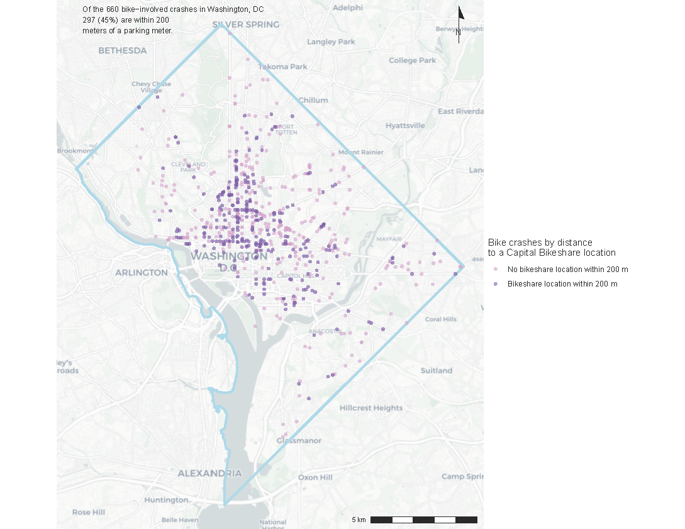
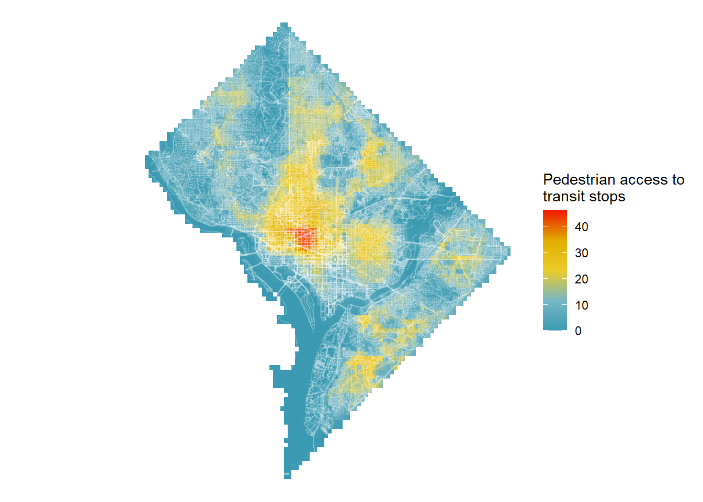

```{r setup, include=FALSE}
knitr::opts_chunk$set(echo = TRUE)
```

This portfolio highlights a selection of maps created for VIS 2127: Spatial Analysis in Fall 2021. The maps selected apply a variety of techniques-- for example, using vector and raster data as well as both static and interactive maps.  Most of these analyses focus on the two places where I've spent most of my life: Northeast Texas and Washington, DC.


# Washington, DC

## Bike Crashes Near Bikeshare Stations
Washington, DC has a robust Capital Bikeshare system with stations distributed throughout the city. However, despite the commitment to increasing bike infrastructure, the District Department of Transportation reports that over the past five years, there have been an average of 334 crashes annually involving bicyclists. This map highlights crashes that occurred within 200m of a Capital Bikeshare station.

[](https://mmcglinchey.github.io/final-portfolio/fullsize/bikecrashes2.pdf){target="_blank"}


## Bike Crashes by Neighborhood
This map illustrates the frequency of bike crashes from 2020 to present day within neighborhood clusters. 

[](https://mmcglinchey.github.io/final-portfolio/fullsize/neighborhoods.pdf){target="_blank"}


## Pedestrian Access to Transit Stops
This map, using a raster layer, shows the walkability of transit stops throughout DC using an assigned accessibility score. It's clear that walkability is highest in the center of the city. 

[](https://mmcglinchey.github.io/final-portfolio/fullsize/pedestrianaccess.pdf){target="_blank"}


# Venice, Italy

This georeferenced map from the Harvard Map Collection shows the impact of potential sea level rise on the city of Venice. 
[](https://mmcglinchey.github.io/final-portfolio/fullsize/Venice Map.pdf){target="_blank"}


# Tarrant County, TX
I grew up in Bedford, TX, which is located in Tarrant County between Dallas and Fort Worth. Given that the Dallas/Ft. Worth region is both sprawling and serviced by few reliable transit options, I was curious to explore how many residents in the region don't have access to a car.  Using data from the 2019 American Communities Survey, this map shows that there are census tracts where up to 12% of people don't have an available vehicle.

[](https://mmcglinchey.github.io/final-portfolio/fullsize/interactive-final.html){target="_blank"}

